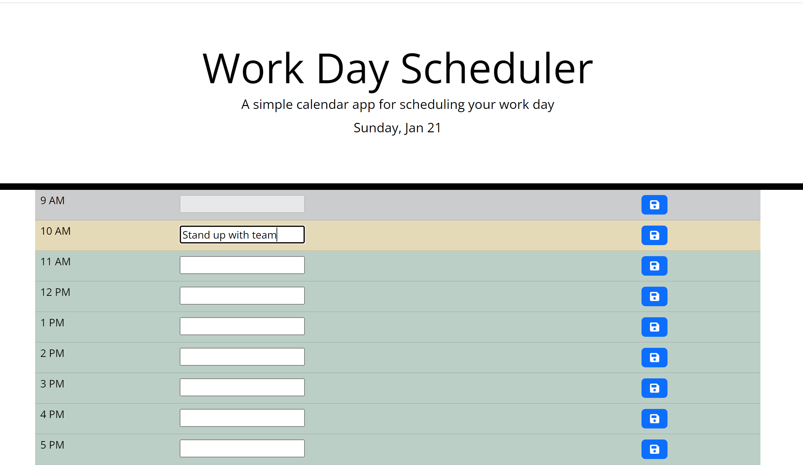

# Work Day Scheduler
Enabling employees  to add important events to a daily planner so that they can manage time effectively.

## Description
The purpose of this project is to create an interactive task scheduler for employees during business hours so that they can manage their day effectively.

## Table of Contents 
- [Installation](#installation)
- [Features](#features)
- [Credits](#credits)
- [License](#license)

## Installation
Click this link for accessing the Work Day Scheduler Application:
https://sumzulfikar.github.io/Work-Day-Scheduler/

The planner for the day is color coded.
1. Work hour is set 9-17(24 hour clock). This is flexible as the hour planner can be adjusted as per workhour for the office.
2. Past hour is grayed out and readonly.
3. Present hour is color coded yellow.
4. Future hours are color coded green.
5. Employee is able to add tasks in the text field for present and future work hours.
6. The tasks added will remain even if the application is refreshed.

Below is screenshot of the application:

## Features
1. Business hours are set for employees so that they see only timeblocks for business hours for setting tasks.
2. The timeblocks are colour codes to according to past present and future hours.
3. Tasks are readonly if the timeblock is in the past
4. User sees the current day displayed
5. Users can input task for current and future hours
6. Once user clicked save button the tasks are save even if the page is refreshed.

## Credits
- Bootcamp Xpert, ask BCS and reviewing documentations for jquery  has been very helpful. 

## License
MIT License

## Badges

## Tests
Acceptance Criteria met.
